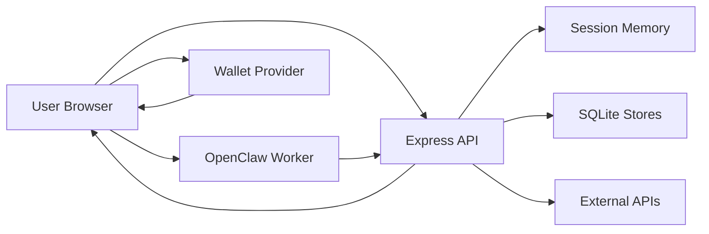

## Executive summary
The highest-risk themes are browser-side compromise of session/house credentials, bearer-style control of agent actions via `teamCode`, and server-side fetch proxy abuse once an attacker can execute in same-origin context. In this repo, cryptographic primitives are generally strong, but key material and control tokens are exposed to browser/runtime trust; with your confirmed single-user context, cross-tenant risks are lower, while account/house takeover and local integrity loss remain high.

## Scope and assumptions
In-scope paths:
- `server/index.js`
- `server/sessions.js`
- `server/store.js`
- `server/atlas.js`
- `server/postageVerifier.js`
- `server/houseVaultBackend.js`
- `public/app.js`
- `public/house.js`
- `public/share_public.js`
- `public/openclaw-lite/runtime-bridge.js`
- `public/openclaw-lite/worker.js`
- `vendors/openclaw-lite-main/src/openclaw-lite/worker.js`
- `public/skill.md`
- `specs/01_experience_flow.md`
- `specs/02_api_contract.md`

Out-of-scope:
- CI/CD pipeline hardening, cloud perimeter/IaC, and third-party provider internals (OpenAI/Privy/Pinata/Solana RPC internals).
- Non-runtime docs/tests except where they enforce security behavior.

Validated assumptions from user context:
- Deployment model: scales depending on number of users (could move beyond single-instance).
- `/api/tools/web_fetch` and `/api/tools/http_request` are intentionally enabled for worker/agent production use.
- Effective tenancy today is single-user (not multi-tenant shared by many unrelated users).

Open questions that can materially change ranking:
- Whether production will run behind multiple app instances soon (affects session/rate-limit risks).
- Whether a reverse proxy/WAF enforces additional egress controls for tool proxy routes.

## System model
### Primary components
- Browser app and modal-first runtime (`public/app.js`) with intent dispatcher (`window.AgentTownExperienceIntent`).
- In-browser OpenClaw Lite worker tool runtime (`public/openclaw-lite/worker.js`; source in `vendors/openclaw-lite-main/src/openclaw-lite/worker.js`).
- Express API server and core auth/session logic (`server/index.js`, `server/sessions.js`).
- Local SQLite stores:
  - session-agnostic app data (`server/store.js` -> `data/store.sqlite`)
  - Atlas ingest data (`server/atlas.js` -> `data/erc8004.sqlite3`)
- External dependencies: OpenAI OAuth, Privy APIs, Pinata upload API, Solana RPC.

### Data flows and trust boundaries
- Internet client -> Express API (`/api/*`)
  - Data: session cookies, team codes, wallet signatures, house-auth headers, payload JSON.
  - Channel: HTTPS/HTTP.
  - Security guarantees: CSP/headers (`setSecurityHeaders`), API no-store headers, rate limits by path/IP.
  - Validation: schema-style field checks, signature checks for selected wallet/token paths.
  - Evidence: `server/index.js` (`setSecurityHeaders`, `rateLimit`, route validators).

- Browser session -> Human session resolver
  - Data: `et_session` cookie, wallet hints (`x-wallet-*`, body wallet fields), team-code hints.
  - Channel: HTTP request metadata/body.
  - Security guarantees: HttpOnly + SameSite cookie set in `ensureHumanSession`.
  - Validation: wallet normalization and best-score session recovery heuristics.
  - Evidence: `server/index.js` (`ensureHumanSession`, `collectWalletCandidatesFromRequest`), `server/sessions.js`.

- Agent worker/tool calls -> Agent API surfaces
  - Data: `teamCode` for `/api/agent/*` flows, ceremony payloads, state transitions.
  - Channel: same-origin fetch.
  - Security guarantees: route-level field validation and existence checks; `/api/agent` rate limiter.
  - Validation: team code presence + lookup only; no possession proof beyond token string.
  - Evidence: `server/index.js` (`/api/agent/connect`, `/api/agent/select`, `/api/agent/open/press`, `/api/agent/house/*`), `server/util.js` (`createTeamCode`).

- Browser/worker -> Tool proxy routes (`/api/tools/web_fetch`, `/api/tools/http_request`)
  - Data: arbitrary URL/method/headers/body and fetched response content.
  - Channel: same-origin POST.
  - Security guarantees: `requireProxySessionAccess` (existing session + same-origin `Origin`/`Referer`).
  - Validation: input normalization only; no explicit private-network destination denylist.
  - Evidence: `server/index.js` (`requireProxySessionAccess`, `/api/tools/*`, `proxyFetch`), `vendors/openclaw-lite-main/src/openclaw-lite/worker.js` (`runWebFetch`, `runHttpRequest`).

- Browser house pages -> House vault/media APIs (`/api/house/:id/*`)
  - Data: ciphertext entries, media, agent-state snapshots, rewards reads.
  - Channel: same-origin with custom auth headers.
  - Security guarantees: HMAC request signing with timestamp and timing-safe compare.
  - Validation: `verifyHouseAuth`, body size/schema checks for state/media.
  - Evidence: `server/index.js` (`verifyHouseAuth`, `/api/house/:id/*`), `public/house.js` (`houseAuthHeaders`).

- Browser storage/wallet -> House auth key material
  - Data: derived house auth bytes and key-wrap/recovery artifacts.
  - Channel: browser memory/sessionStorage + wallet signing UX.
  - Security guarantees: crypto derivation and signed messages.
  - Validation: key length checks; signature verification server-side.
  - Evidence: `public/house.js` (`sessionStorage.setItem(houseAuthCacheKey...)`), `public/share_public.js` (same pattern), `server/index.js` (`verifySolanaSignature`, `/api/wallet/lookup`).

- Server -> External providers (OpenAI/Privy/Pinata/Solana)
  - Data: OAuth auth codes/tokens, sponsored transaction relay, metadata uploads, token-ownership checks.
  - Channel: outbound HTTPS.
  - Security guarantees: provider auth headers, strict body normalization for Privy relay.
  - Validation: field normalization, response checks.
  - Evidence: `server/index.js` (`exchangeOpenAiCodexAuthorizationCode`, `relayPrivyWalletRpc`, Pinata helpers, Solana RPC helpers).

#### Diagram

## Assets and security objectives
| Asset | Why it matters | Security objective (C/I/A) |
|---|---|---|
| `et_session` cookie + session binding | Controls current browser identity and state continuity. | C, I |
| `teamCode` | Grants control of `/api/agent/*` co-op actions and state. | C, I |
| House auth key (`authKey`/derived key bytes) | Authorizes vault/media/state writes and reads. | C, I |
| House key-wrap and unlock material (`keyWrap`, wallet-signature path) | Enables house key recovery and long-term house access. | C, I |
| Store integrity (`data/store.sqlite`) | Canonical state for houses/shares/claims/inbox/milestones. | I, A |
| Atlas ingest store (`data/erc8004.sqlite3`) | Drives Atlas district/agent views and ranking outputs. | I, A |
| Privy app secret / server relay credentials | Can authorize sponsored transaction relay and status reads. | C, I |
| OAuth access credentials (OpenAI codex profile) | Grants model access under user account context. | C |

## Attacker model
### Capabilities
- Remote attacker can send arbitrary internet traffic to exposed endpoints.
- Attacker can attempt social engineering/phishing for wallet signatures.
- Attacker can inject malicious prompts/content that the worker may process.
- Attacker with same-origin script execution foothold (XSS, malicious extension, compromised dependency) can issue authenticated API calls from victim browser context.

### Non-capabilities
- No assumed direct filesystem or DB shell access on server host.
- No assumed break of cryptographic primitives (HMAC/SHA-256/ECDSA/Ed25519/AES-GCM).
- Multi-tenant cross-user lateral movement is de-emphasized because current usage is single-user.

## Entry points and attack surfaces
| Surface | How reached | Trust boundary | Notes | Evidence (repo path / symbol) |
|---|---|---|---|---|
| `GET /api/session`, `POST /api/session/reset` | Browser fetch with cookie | Browser -> Session manager | Session bootstrap and rotation; duplicated route blocks present. | `server/index.js` (`/api/session`, `/api/session/reset`, duplicate definitions) |
| `POST /api/agent/connect` | API call with `teamCode` | Agent/Browser -> Session state | Team-code-only control to mark agent connected. | `server/index.js` (`/api/agent/connect`) |
| `POST /api/agent/select`, `POST /api/agent/open/press` | API call with `teamCode` | Agent/Browser -> Co-op state | Mutates lock/open flow using bearer `teamCode`. | `server/index.js` (`/api/agent/select`, `/api/agent/open/press`) |
| `POST /api/agent/house/commit`, `POST /api/agent/house/reveal` | API call with `teamCode` | Agent/Browser -> Ceremony state | Sets cryptographic ceremony artifacts. | `server/index.js` (`/api/agent/house/*`) |
| `POST /api/tools/web_fetch` | Worker proxy fetch | Worker -> Server egress | Server-side URL fetch, returns text/hash/meta. | `server/index.js` (`/api/tools/web_fetch`, `proxyFetch`) |
| `POST /api/tools/http_request` | Worker proxy fetch | Worker -> Server egress | Arbitrary method/headers/body proxying. | `server/index.js` (`/api/tools/http_request`) |
| `GET/POST /api/house/:id/*` | Browser house pages | Browser -> House vault/media | Uses HMAC headers; includes state/media mutation. | `server/index.js` (`verifyHouseAuth`, `/api/house/:id/*`) |
| `POST /api/wallet/lookup` | Browser wallet flow | Browser/wallet -> House binding | Optional nonce path + signature recovery for house lookup/keyWrap retrieval. | `server/index.js` (`/api/wallet/lookup`, `buildHouseKeyWrapMessage`) |
| `POST /api/token/verify` | Browser wallet flow | Browser/wallet -> Signup state | Solana signature + token ownership check via RPC. | `server/index.js` (`/api/token/verify`, `hasElizaTownToken`) |
| `POST /api/privy/wallet-rpc/prepare|relay` | Browser -> server relay | Browser -> Privy relay backend | Sponsored transaction relay via server secrets and user signature header. | `server/index.js` (`normalizePrivyWalletRpcBody`, `relayPrivyWalletRpc`) |
| OpenAI OAuth callback page | Popup callback server | OAuth provider -> Browser opener | Callback posts message to opener with wildcard target. | `server/index.js` (`buildOpenAiCodexOAuthCallbackPage`) |
| Atlas district/search APIs | Browser fetch | Browser -> Atlas cache/data | Public-ish searchable listing with pagination/caching. | `server/index.js` (`/api/atlas/*`), `server/atlas.js` |

## Top abuse paths
1. Agent control hijack via leaked `teamCode`.
   1. Attacker obtains `teamCode` from logs/UI/screenshot/debug output.
   2. Attacker calls `/api/agent/connect` and `/api/agent/select` with that code.
   3. Attacker calls `/api/agent/open/press` and ceremony endpoints.
   4. Co-op flow integrity is corrupted; user sees spoofed/forced agent actions.

2. Same-origin compromise -> SSRF-like egress abuse via tool proxy.
   1. Attacker gets same-origin JS execution (XSS or malicious extension).
   2. Script calls `/api/tools/http_request` to internal/private targets.
   3. Server fetches targets and returns response body.
   4. Attacker exfiltrates internal data reachable from server network.

3. House auth key extraction from browser storage.
   1. Attacker executes JS in victim browser context.
   2. Reads cached house-auth bytes from `sessionStorage`.
   3. Generates valid `x-house-auth` signatures.
   4. Reads or mutates `/api/house/:id/*` content without wallet prompt.

4. Wallet-signature phishing for house recovery.
   1. Attacker asks victim to sign a plausible “house wrap/lookup” message.
   2. Reuses signature in house lookup/recovery path.
   3. Obtains `houseId`/`keyWrap` linkage and pivots to unauthorized recovery attempts.
   4. House confidentiality/integrity is at risk.

5. Sponsored transaction abuse through Privy relay.
   1. Attacker manipulates runtime or user intent to sign relay payload.
   2. Calls `/api/privy/wallet-rpc/relay` with sponsored transaction body.
   3. Uses app’s Privy server auth path for repeated sponsored operations.
   4. Financial/resource abuse or unwanted on-chain operations occur.

6. OAuth callback message interception attempt.
   1. Attacker controls opener context or races callback UI handling.
   2. Callback posts payload using `postMessage(..., '*')`.
   3. Malicious listener captures callback metadata.
   4. Depending on state handling elsewhere, can aid token theft attempts.

7. Availability degradation from state management drift.
   1. Traffic increases or app restarts occur.
   2. In-memory sessions/rate-limits reset or diverge across instances.
   3. Duplicate/stale routes produce inconsistent behavior.
   4. Users lose continuity or hit degraded/incorrect flows.

## Threat model table
| Threat ID | Threat source | Prerequisites | Threat action | Impact | Impacted assets | Existing controls (evidence) | Gaps | Recommended mitigations | Detection ideas | Likelihood | Impact severity | Priority |
|---|---|---|---|---|---|---|---|---|---|---|---|---|
| TM-001 | Remote attacker with leaked token | Attacker learns a valid `teamCode` (e.g., UI/log leak). | Calls `/api/agent/*` endpoints with bearer `teamCode` to spoof agent actions. | Co-op/session integrity compromise; unauthorized ceremony progression. | `teamCode`, session state, ceremony state | Randomized team codes and existence checks; `/api/agent` rate limiting (`server/util.js#createTeamCode`, `server/index.js#rateLimit`, `/api/agent/*`). | No proof-of-possession beyond string token; no binding to originating session/agent key. | Add agent possession proof: challenge-response token bound to current human session; rotate/revoke team codes after connect; optional short TTL and lockout after repeated failures. | Log `TEAM_NOT_FOUND` / invalid teamCode bursts per IP; alert on agent actions from new IP/UA for same teamCode. | Medium | High | high |
| TM-002 | Same-origin script attacker (XSS/extension/prompt-to-tool abuse) | Same-origin execution in victim browser session. | Uses `/api/tools/web_fetch` and `/api/tools/http_request` as server-side egress proxy to internal/private endpoints. | Internal data exfiltration and server-network pivoting. | Internal network reachability, app secrets, user data | Proxy access requires existing session + same-origin origin/referer (`requireProxySessionAccess` in `server/index.js`). Worker has per-origin rate cap (`vendors/openclaw-lite-main/src/openclaw-lite/worker.js#consumeHttpRateLimit`). | Server proxy lacks explicit private IP/metadata denylist and destination policy. | Enforce outbound policy at server: block RFC1918/loopback/link-local/metadata IPs, restrict ports/protocols, optional domain allowlist for worker tools, and stricter response-size caps. | Structured logs on proxy destination host/IP class and status; alert on denied internal-address attempts. | Medium | High | high |
| TM-003 | Browser-compromise attacker | JS execution in browser or access to live session storage. | Reads cached house-auth key bytes from `sessionStorage`, signs house requests, mutates/reads house data. | Unauthorized vault/media/state access with valid auth headers. | House auth key, house vault/media/state | HMAC signature + timestamp skew + timing-safe compare (`verifyHouseAuth` in `server/index.js`). | Exportable key bytes persisted in session storage (`public/house.js`, `public/share_public.js`); replay window exists within skew. | Keep non-exportable `CryptoKey` in-memory only; avoid persistent raw key bytes; add nonce/challenge per write for anti-replay; optional step-up wallet confirmation for sensitive writes. | Alert on unusual `HOUSE_AUTH_INVALID` spikes and write bursts per house; track write source fingerprints. | Medium | High | high |
| TM-004 | Phishing/social engineering attacker | Victim signs attacker-chosen wallet messages. | Replays signatures in lookup/recovery-related flows to bind or retrieve house/key metadata. | House recovery takeover risk and identity misuse. | Wallet trust, `keyWrap`, house binding | Signature verification exists for wallet/token paths (`verifySolanaSignature`, `/api/wallet/lookup`, `/api/token/verify`). Nonce path supported in wallet lookup. | Wallet lookup has a fallback path that can proceed without nonce when `houseId` supplied; signature context may be socially replayed. | Require nonce+expiry for all wallet lookup/recovery signatures; include origin and purpose hash in signed text; reject nonced message reuse server-side. | Track and alert non-nonce lookup usage and repeated signatures across IP/device fingerprints. | Medium | High | high |
| TM-005 | Runtime/tool misuse attacker | Attacker can induce signed relay payloads or runtime misuse. | Abuses Privy sponsored relay endpoints for unwanted transactions/resource spend. | Financial/resource abuse, unauthorized chain actions. | Privy sponsor path, user wallet operations | Strong body normalization and required authorization signature (`normalizePrivyWalletRpcBody`, `relayPrivyWalletRpc` in `server/index.js`). | No per-session policy guardrails (destination/value/rate) beyond schema validity; relay routes are not separately rate-limited. | Add relay policy engine: per-wallet limits, allowed methods/chains, max value/gas, denylist contracts; add dedicated rate limiters and abuse throttles. | Monitor transaction volume, sponsor spend, failure codes, and anomalous destination patterns. | Medium | Medium | medium |
| TM-006 | Browser/opener manipulation attacker | Attacker can influence opener context around OAuth callback window. | Intercepts callback payload due `postMessage(..., '*')` target origin wildcard. | Callback metadata disclosure; could aid token misuse if combined with other flaws. | OAuth callback data, LLM credential flow | Server-side state-to-attempt mapping and session checks reduce direct token exchange abuse (`/api/agent/lite/llm/oauth/openai-codex/*`). | Wildcard postMessage target origin broadens message recipient risk in browser context. | Use strict `targetOrigin` and verify opener origin before postMessage; include one-time callback nonce bound to session/tab. | Log state mismatches and suspicious callback attempts; alert on repeated exchange failures. | Low | Medium | medium |
| TM-007 | Availability attacker / operational drift | Higher concurrency, process restarts, or multi-instance rollout. | Triggers session/rate-limit inconsistency and route drift behavior to degrade service. | Session continuity failures, inconsistent auth/routing behavior. | Availability and integrity of session flow | SQLite persistence for durable store; in-memory rate limits and sessions currently simple (`server/store.js`, `server/sessions.js`, `server/index.js#rateLimit`). | Session and limits are in-memory only; duplicate/stale route blocks exist in `server/index.js`. | Move sessions/rate limits to shared store (Redis); de-duplicate route definitions; add route-contract tests for single source of truth. | Track restart-driven session churn, 401/403 spikes, and endpoint-level behavior drift via synthetic tests. | Medium | Medium | medium |
| TM-008 | Internet request flooder | Public access to atlas/search surfaces. | Floods Atlas endpoints and expensive query paths to consume CPU/IO. | Performance degradation and reduced UX availability. | Availability of API and Atlas UX | Snapshot and district caches, pagination, result limits (`server/atlas.js`, `server/index.js` atlas cache helpers). | No dedicated rate limiter on Atlas endpoints; cache misses can still be expensive under churn. | Add per-IP rate limits for `/api/atlas/*`; add request budget and timeout/circuit breaker metrics. | Monitor latency/error rates and cache hit ratio for Atlas endpoints. | Medium | Low | low |

## Criticality calibration
Critical in this repo means likely compromise of house control or signing authority with durable impact.
- Example 1: Theft/replay of wallet-signature material enabling unauthorized house recovery/key access.
- Example 2: Server or browser compromise that exposes Privy server secret and enables unauthorized transaction relay at scale.

High means major integrity/confidentiality compromise requiring realistic but non-trivial preconditions.
- Example 1: `teamCode` hijack causing unauthorized `/api/agent/*` state changes.
- Example 2: Same-origin compromise abusing `/api/tools/http_request` to reach internal services and exfiltrate data.
- Example 3: House auth key extraction from browser storage leading to unauthorized house writes.

Medium means meaningful abuse with bounded blast radius or stronger prerequisites.
- Example 1: Privy relay misuse requiring valid authorization signatures.
- Example 2: OAuth callback message interception attempts mitigated by state/session checks.
- Example 3: Session/rate-limit inconsistency under scaling causing operational instability.

Low means limited impact or issues mostly causing nuisance/perf degradation.
- Example 1: Atlas endpoint request floods mitigated by caching and small page limits.
- Example 2: Minor information leakage from non-sensitive metadata endpoints.

## Focus paths for security review
| Path | Why it matters | Related Threat IDs |
|---|---|---|
| `server/index.js` | Central auth/session/route surface, tool proxies, house auth, OAuth, Privy relay. | TM-001, TM-002, TM-003, TM-004, TM-005, TM-006, TM-007, TM-008 |
| `server/sessions.js` | In-memory session identity mapping and wallet/team-code indexes. | TM-001, TM-007 |
| `server/util.js` | Team code generation and cookie parsing primitives. | TM-001 |
| `server/store.js` | SQLite persistence model and migration behavior affecting integrity/availability. | TM-007 |
| `server/atlas.js` | Atlas data loading/query logic and cache behavior under load. | TM-008 |
| `public/app.js` | Intent dispatcher policy, modal-only flow, worker continuity, UI tool guardrails. | TM-002, TM-006 |
| `public/skill.md` | Agent behavior contract that can trigger sensitive tool/API actions. | TM-001, TM-002, TM-005 |
| `public/house.js` | House auth signing flow, key derivation, and browser key handling. | TM-003, TM-004 |
| `public/share_public.js` | House auth recovery/cache path used outside core house page. | TM-003 |
| `public/openclaw-lite/worker.js` | Runtime tool surface and behavior in production build. | TM-002, TM-005 |
| `vendors/openclaw-lite-main/src/openclaw-lite/worker.js` | Source of tool implementations (`web_fetch`, `http_request`, UI/state tools, grants). | TM-002, TM-005 |
| `e2e/108_experience_intent_open_modal.spec.js` | Verifies modal-only no-route-change intent baseline. | TM-002 |
| `e2e/112_experience_intent_policy_negative.spec.js` | Validates unknown intent rejection and selector/html blocking. | TM-002 |
| `specs/02_api_contract.md` | Intended API security contract baseline to compare runtime reality. | TM-001, TM-007 |

## Quality check
- [x] Covered discovered runtime entry points and major externally reachable APIs.
- [x] Represented each key trust boundary in threat enumeration.
- [x] Separated runtime behavior from CI/dev concerns.
- [x] Incorporated user context clarifications (single-user, proxy tools required, scaling depends on users).
- [x] Kept assumptions and open questions explicit.
