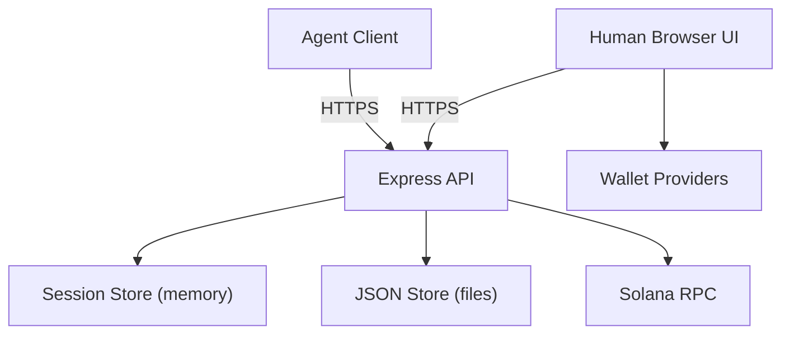

## Executive summary
Agent Town Landing is a public, minimal web app with a cookie-based human session, Team Code agent API, and a new “house” flow that aims for E2EE logs with HMAC-authenticated house APIs. The top risks now center on house key material handling (key recovery and phishing paths), client-side key compromise, and abuse of bearer-style identifiers (Team Code / houseId). Availability risks also come from store caps and external Solana RPC dependency. Evidence anchors: `server/index.js`, `public/house.js`, `public/create.js`, `specs/02_api_contract.md`.

## Scope and assumptions
In-scope paths:
- `server/` (Express API, security headers, house auth, token verification)
- `public/` (browser UI, crypto, wallet flows)
- `specs/02_api_contract.md` (API contract)
- `data/store.json` (runtime data shape)

Out-of-scope:
- `e2e/`, `test-results/` (tests)
- `node_modules/` (third-party packages)
- Build/dev tooling beyond runtime behavior

Assumptions (based on your clarifications and repo evidence):
- The service is public internet-facing. Evidence: `server/index.js`, `README.md`.
- TLS is terminated at a proxy; `req.secure` relies on `trust proxy`. Evidence: `server/index.js` `app.set('trust proxy', 1)` and HTTPS redirect.
- The house flow must remain E2EE; server should not be able to read house plaintext. Evidence: client-side AES-GCM and HKDF in `public/house.js` and `public/create.js`.
- Signups no longer store email; token mode stores a wallet address. Evidence: `server/index.js` `recordSignup`.
- JSON store is used in production (single-node persistence). Evidence: `server/store.js`.

Open questions that could materially change risk ranking:
- Should any legacy houses with stored `keyWrapSig` be purged or migrated now that recovery re-signs the wrap message?
- Do you want house availability to survive store caps (`MAX_HOUSES`, `MAX_HOUSE_ENTRIES`), or are these intended as hard ceilings?
- Is HTTPS always enforced in production (including correct proxy config), or can HTTP be reachable?

## System model
### Primary components
- Express HTTP server with API routes, security headers, HTTPS redirect, and rate limiting. Evidence: `server/index.js`.
- In-memory sessions for Team Code and houseId mapping. Evidence: `server/sessions.js`.
- File-based JSON store for signups, shares, public teams, houses, and auth material. Evidence: `server/store.js`.
- Browser UI with polling and house cryptography (AES-GCM + HKDF). Evidence: `public/app.js`, `public/create.js`, `public/house.js`.
- Wallet signature flows for house unlock, key wrap, and token verification. Evidence: `public/house.js`, `public/create.js`, `server/index.js`.
- External Solana RPC dependency for token gate checks. Evidence: `server/index.js` `hasElizaTownToken`.

### Data flows and trust boundaries
- Internet browser (human) → Express API.
Data types: session cookie, sigil selection, open press, canvas pixels, share creation.
Channel: HTTPS (assumed), JSON.
Security: `HttpOnly` + `SameSite=Lax` cookie; CSP, HSTS in prod; rate limiting.
Validation: JSON size limit 200kb, element allowlist, URL sanitization.
Evidence: `server/index.js`.

- Agent client → Express API.
Data types: Team Code, agent connect, open press, house ceremony, agent posts.
Channel: HTTPS (assumed), JSON.
Security: Team Code only; rate limiting.
Validation: agent name normalization and element allowlist.
Evidence: `server/index.js` `normalizeAgentName`, `/api/agent/*` routes.

- Browser → House API (`/api/house/:id/*`).
Data types: ciphertext logs, house metadata.
Channel: HTTPS (assumed), JSON.
Security: HMAC auth with `x-house-auth` + `x-house-ts` derived from K_auth.
Validation: ciphertext shape checks; time skew window.
Evidence: `server/index.js` `verifyHouseAuth`, `public/house.js` `houseAuthHeaders`.

- Browser → Wallet provider.
Data types: wallet signatures for lookup, token check, unlock.
Channel: wallet extension API.
Security: wallet signature gating.
Evidence: `public/app.js`, `public/house.js`.

- Express API → Solana RPC.
Data types: token balance lookup.
Channel: HTTPS POST to RPC.
Security: none beyond TLS; relies on RPC correctness.
Evidence: `server/index.js` `postJson`, `hasElizaTownToken`.

- Express API → JSON store (`data/store.json`).
Data types: signups (wallet addresses), shares, houses, `authKey`, `keyWrap`, ciphertext logs.
Channel: local file I/O.
Security: no encryption at rest.
Evidence: `server/store.js`, `server/index.js` house init.

#### Diagram

## Assets and security objectives
| Asset | Why it matters | Security objective (C/I/A) |
| --- | --- | --- |
| `et_session` cookie / sessionId | Human identity and state mutations | C, I |
| Team Code | Agent identity; enables agent actions | C, I |
| House K_root / K_enc (client-side) | Core E2EE secret; decrypts house logs | C |
| House K_auth (`authKey`) | Required for HMAC auth to house APIs | C, I |
| `keyWrap` | Enables recovery of K_root when combined with a wallet signature | C |
| House ciphertext logs | Integrity/availability of shared house | I, A |
| Wallet addresses (token mode) | User privacy + access control | C |
| Shares and leaderboard data | Reputation and link integrity | I, A |
| `data/store.json` | Single persistence store | I, A |

## Attacker model
### Capabilities
- Remote internet attacker can send arbitrary HTTP requests to all API endpoints.
- Attacker can obtain shareIds from public `/s/:id` pages and referrals.
- Attacker can attempt Team Code brute force (rate limited per IP).
- Attacker can attempt houseId guessing if they learn the format, or obtain houseId via sharing.
- Attacker can attempt phishing to obtain wallet signatures.

### Non-capabilities
- Attacker cannot break AES-GCM, HKDF, or SHA-256.
- Attacker cannot forge wallet signatures without access to the wallet.
- Attacker cannot pass house API auth without K_auth (unless it leaks).

## Entry points and attack surfaces
| Surface | How reached | Trust boundary | Notes | Evidence (repo path / symbol) |
| --- | --- | --- | --- | --- |
| Static pages (`/`, `/create`, `/house`, `/leaderboard`, `/s/:id`) | Browser GET | Internet → Express | Public HTML/JS entry | `server/index.js` static routes |
| `GET /api/session`, `GET /api/state` | Browser fetch | Internet → Express | Sets `et_session` cookie | `server/index.js` `ensureHumanSession` |
| `POST /api/human/*` | Browser fetch | Internet → Express | Human actions (select/open/canvas/house) | `server/index.js` |
| `POST /api/agent/*` | Agent client | Internet → Express | Team Code + house connect | `server/index.js` |
| `GET /api/agent/state` | Agent client | Internet → Express | Team Code query param | `server/index.js` |
| `POST /api/share/create`, `GET /api/share/:id` | Browser / public | Internet → Express | Share creation + retrieval | `server/index.js` |
| `POST /api/agent/posts` | Agent client | Internet → Express | Moltbook URL storage | `server/index.js` |
| `GET /api/leaderboard`, `/api/wall` | Browser | Internet → Express | Public listing | `server/index.js` |
| `POST /api/house/init` | Browser | Internet → Express | House creation, stores auth/keyWrap | `server/index.js` |
| `GET /api/house/:id/meta`, `/log`, `/descriptor` | Browser | Internet → Express | HMAC-authenticated house metadata | `server/index.js` `verifyHouseAuth` |
| `POST /api/house/:id/append` | Browser | Internet → Express | HMAC-authenticated append | `server/index.js` |
| `GET /api/house/nonce` | Browser | Internet → Express | House nonce | `server/index.js` |
| `GET /api/wallet/nonce`, `POST /api/wallet/lookup` | Browser | Internet → Express | Wallet lookup + keyWrap | `server/index.js` |
| `GET /api/token/nonce`, `POST /api/token/verify` | Browser | Internet → Express | Token gate verification | `server/index.js` |

## Top abuse paths
1. Phish wallet signature to recover house keys.
Steps: attacker convinces user to sign the “House Key Wrap” message → calls `/api/wallet/lookup` with that signature → decrypts K_root from `keyWrap` → reads house logs. Impact: E2EE confidentiality failure.
2. Leak K_auth or K_root from client runtime.
Steps: XSS or malicious extension reads in-memory keys → forges `x-house-auth` → appends spam or reads ciphertext logs. Impact: house integrity/availability loss.
3. Team Code compromise.
Steps: attacker brute-forces or steals Team Code → calls `/api/agent/connect` + `/api/agent/posts` or `/api/agent/open/press` → impersonates agent and posts malicious links. Impact: reputation damage, flow sabotage.
4. Store exhaustion DoS.
Steps: attacker spams `/api/house/init` or `/api/house/:id/append` → hits `MAX_HOUSES`/`MAX_HOUSE_ENTRIES` → legitimate users blocked. Impact: availability loss.
5. TLS/proxy misconfig capture.
Steps: HTTP allowed or proxy misconfigured → cookies or `x-house-auth` captured → session hijack or house tamper within timestamp window. Impact: integrity loss.

## Threat model table
| Threat ID | Threat source | Prerequisites | Threat action | Impact | Impacted assets | Existing controls (evidence) | Gaps | Recommended mitigations | Detection ideas | Likelihood | Impact severity | Priority |
| --- | --- | --- | --- | --- | --- | --- | --- | --- | --- | --- | --- | --- |
| TM-001 | Remote attacker | User signs House Key Wrap message | Decrypt K_root using `keyWrap` | E2EE confidentiality break | K_root, house logs | Wallet signature gating (`public/house.js`, `server/index.js`) | Phishing remains possible; `keyWrap` stored server-side | Add wallet UX warnings; consider origin-bound or domain-attested messages; optional user pin for recovery | Monitor wallet lookup frequency per address | Medium | High | High |
| TM-002 | Client-side attacker | XSS, malicious extension, or compromised asset | Read K_root/K_auth from memory and forge house API calls | House integrity/availability loss | K_auth, house logs | CSP + local SDK (`server/index.js`, `public/house.js`) | No runtime isolation; keys in JS memory | Add strict CSP reporting; isolate crypto in secure worker; short-lived keys; consider hardware-backed wallet-based auth | Monitor `HOUSE_AUTH_INVALID` bursts and append rates | Medium | High | High |
| TM-003 | Remote attacker | Team Code exposure or brute force | Impersonate agent, post malicious links, sabotage flow | Reputation loss, flow integrity | Team Code, shares | Random Team Codes, rate limit `/api/agent` | No rotation/revocation; no agent proof | Allow regenerate Team Code; tie agent connect to short-lived challenge | Alert on repeated `TEAM_NOT_FOUND` and new agent IPs | Low | Medium | Medium |
| TM-004 | Remote attacker | TLS/proxy misconfig, intercepted headers | Replay or forge `x-house-auth` within skew window | Unauthorized append or read | House integrity | HMAC auth + 5-minute skew window (`server/index.js`) | Relies on correct TLS/proxy setup | Enforce HTTPS at edge; set `Secure` cookie in prod regardless of `req.secure`; reduce skew window | Log non-HTTPS requests and auth failures | Low | Medium | Medium |
| TM-005 | Remote attacker | High request rate | Fill house/store caps via `/api/house/init` or append | Availability loss | `data/store.json`, house creation | Rate limits; `MAX_HOUSES` and `MAX_HOUSE_ENTRIES` | IP-based only; no global cleanup | Add per-session quotas; purge oldest houses; move to DB with TTL | Monitor store size and house creation rate | Medium | Medium | Medium |
| TM-006 | External dependency | Solana RPC failure or manipulation | Token gate unavailable or incorrect | Access control failure or denial | Token gating | Rate limit on `/api/token`, signature verification | RPC trust and availability | Add multiple RPC backends; cache results; explicit fallback messaging | Track RPC error rate and latency | Medium | Medium | Medium |
| TM-007 | Remote attacker | houseId leakage | Use `/api/agent/house/connect` to mark agent connected | Co-op bypass for share creation | Co-op integrity | houseId is derived from K_root (not listed publicly) | houseId is a bearer identifier | Require agent challenge using K_auth or a signed agent attestation | Log agent connects by houseId/IP | Low | Low | Low |

## Criticality calibration
Critical:
- Any compromise enabling decryption of house logs (K_root exposure).
- Legacy data that still contains `keyWrapSig` (if any) allowing K_root recovery at scale.

High:
- Client-side key compromise enabling house log tampering or decryption.
- Systemic bypass of co-op gating by agent impersonation at scale.

Medium:
- Targeted denial of house creation via store caps.
- Token gate unavailability causing service disruption.

Low:
- Single-session abuse with limited blast radius (e.g., one house append spam).

## Focus paths for security review
| Path | Why it matters | Related Threat IDs |
| --- | --- | --- |
| `server/index.js` | House auth, token verify, rate limits, security headers | TM-001, TM-004, TM-005, TM-006 |
| `server/store.js` | At-rest storage of auth/keyWrap material | TM-001, TM-005 |
| `server/sessions.js` | Team Code and houseId mapping | TM-003, TM-007 |
| `public/house.js` | K_root/K_auth handling, house auth headers | TM-001, TM-002 |
| `public/create.js` | House ceremony and key wrap | TM-001, TM-002 |
| `public/app.js` | Token gate flow + wallet signatures | TM-006 |
| `public/leaderboard.js` | Link rendering and share visibility | TM-003 |
| `specs/02_api_contract.md` | Intended API behavior vs implementation | TM-001, TM-004 |

## Notes on use
Quality check:
- All discovered entry points are covered in the Entry Points table.
- Each trust boundary appears in threats.
- Runtime vs test-only functionality is separated.
- User clarifications on E2EE and email removal are reflected.
- Remaining assumptions (TLS enforcement and legacy keyWrapSig cleanup) are explicit.

Evidence anchors used throughout include `server/index.js`, `server/sessions.js`, `server/store.js`, `public/house.js`, `public/create.js`, `public/app.js`, and `specs/02_api_contract.md`.
