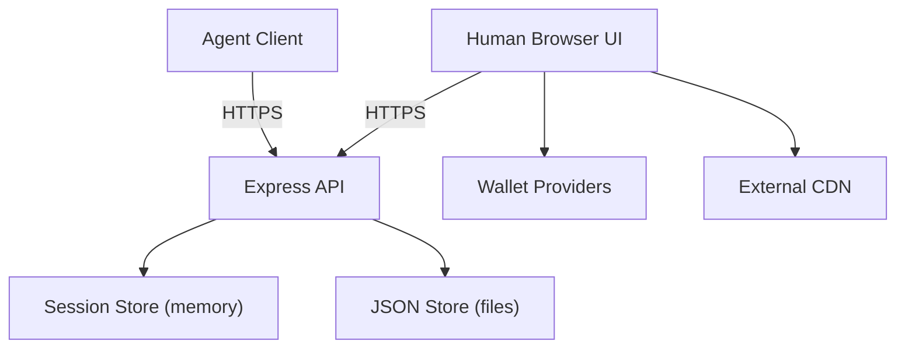

## Executive summary
Agent Town Landing is a public, minimal web app with a cookie-based human session and a Team Code-based agent API, backed by in-memory sessions and a local JSON store. The highest risks come from unauthenticated write surfaces (share management and room append), stored XSS on public pages, and transport/session hardening gaps. Because room artifacts are intended to be E2EE and not readable by the server, integrity and cryptographic access control for `/api/room/:id/*` are the most urgent security gaps. Evidence anchors: `server/index.js`, `public/room.js`.

## Scope and assumptions
In-scope paths:
- `server/` (Express API, session and storage logic)
- `public/` (browser UI and crypto flows)
- `specs/02_api_contract.md` (API contract)
- `data/store.json` (runtime data shape)

Out-of-scope:
- `e2e/`, `test-results/` (tests)
- `node_modules/` (third-party packages)
- Build/dev tooling beyond runtime behavior

Assumptions (based on your clarifications):
- The service is public internet-facing. Evidence: `README.md`, `server/index.js` route exposure.
- TLS termination is present but not confirmed; the Node server does not enforce HTTPS. Evidence: cookie set without `Secure` in `server/index.js`.
- Optional post URLs/handles are stored; treat them as low-sensitivity PII. Evidence: `server/index.js`, `server/store.js`.
- Room artifacts must be E2EE and not readable by the server; access must be cryptographically secured using the room key (K_root). Evidence: client-side AES-GCM in `public/room.js`.
- Single-node deployment with local JSON persistence. Evidence: `server/store.js` writes `data/store.json`.

Open questions that could materially change risk ranking:
- Is HTTPS enforced end-to-end (HSTS/redirects), or could HTTP be reachable in production?
- What are the expected scale and abuse tolerance (rate limits, per-IP caps)?
- Data retention policy for `data/store.json` (shares, post URLs/handles, room logs)?
- Is multi-tenancy a requirement (strong isolation between teams), or is this a demo-only model?

## System model
### Primary components
- Express HTTP server with JSON API and static file serving. Evidence: `server/index.js`.
- In-memory session and Team Code mapping. Evidence: `server/sessions.js`.
- File-based JSON store for signups, shares, public teams, rooms. Evidence: `server/store.js`, `data/store.json`.
- Browser UI and polling logic for human flow. Evidence: `public/app.js`, `public/create.js`.
- E2EE room client logic (K_root, AES-GCM, wallet signature). Evidence: `public/room.js`.
- External wallet providers (Solana/EVM). Evidence: `public/create.js`, `public/room.js`.
- External Agent0 SDK loaded from CDN. Evidence: `public/room.js`.

### Data flows and trust boundaries
- Internet browser (human) -> Express API
  Data: session cookie, sigil selection, canvas pixels, shareId, URLs. Protocol: HTTP/HTTPS. Security: `HttpOnly` + `SameSite=Lax` cookie, no CSRF token, no auth for many endpoints. Validation: JSON size limit 200kb, element allowlist, URL sanitization. Evidence: `server/index.js`.
- Internet agent client -> Express API
  Data: Team Code, selections, posts, room ceremony commit/reveal. Protocol: HTTP/HTTPS. Security: Team Code only, no rate limit. Validation: element allowlist and basic trims. Evidence: `server/index.js`, `server/sessions.js`.
- Express API -> In-memory sessions
  Data: human/agent state, match, signup, room ceremony. Internal trust boundary. Evidence: `server/sessions.js`.
- Express API -> JSON store
  Data: signups (team codes + matched element), shares, public teams, rooms, ciphertext logs, post URLs. File I/O boundary, no encryption at rest. Evidence: `server/store.js`.
- Browser -> Wallet providers
  Data: unlock message, wallet signatures, key derivation. Trust boundary to wallet extension. Evidence: `public/room.js`, `public/create.js`.
- Browser -> External CDN
  Data: loads `agent0-sdk` JS at runtime; executes in page origin. Evidence: `public/room.js`.

#### Diagram

## Assets and security objectives
| Asset | Why it matters | Security objective (C/I/A) |
| --- | --- | --- |
| `et_session` cookie / sessionId | Only human identity; used to mutate state and create shares | C, I |
| Team Code | Only agent identity; enables agent actions | C, I |
| Post URLs / handles (optional) | Low-sensitivity PII | C |
| Shares / leaderboard metadata | Public reputation, link integrity, anti-spam | I, A |
| Room wrappedKey + ciphertext logs | E2EE data; server should not read plaintext | C, I |
| K_root / Kenc (client-side keys) | Exposure breaks E2EE guarantees | C |
| `data/store.json` | Single persistence store; corruption or growth affects availability | I, A |
| Service availability | User flow depends on responsive API | A |

## Attacker model
### Capabilities
- Remote internet attacker can send arbitrary HTTP requests to all API endpoints.
- Attacker can access public share URLs and extract shareIds from `/s/:id` pages.
- Attacker can supply arbitrary `agentName` via `/api/agent/connect` if they know a Team Code.
- Attacker can script high-rate requests because no rate limiting is present.
- Attacker can influence external content by hosting URLs provided in `xPostUrl`/`moltbookUrl`.

### Non-capabilities
- Attacker cannot break SHA-256 or AES-GCM or derive K_root without the room ceremony/wallet signature.
- Attacker cannot read `HttpOnly` cookies directly from browser JS without an XSS.
- Attacker does not have server filesystem access unless they exploit a separate server compromise.
- Attacker does not have access to user wallet private keys (assuming wallet security holds).

## Entry points and attack surfaces
| Surface | How reached | Trust boundary | Notes | Evidence (repo path / symbol) |
| --- | --- | --- | --- | --- |
| Static pages (`/`, `/create`, `/room`, `/leaderboard`, `/share/:id`, `/s/:id`) | Browser GET | Internet -> Express | Public HTML/JS entry | `server/index.js` `app.use(express.static)` and `app.get('/create' ...)` |
| `GET /api/session` | Browser fetch | Internet -> Express | Sets `et_session` cookie if missing | `server/index.js` `ensureHumanSession` |
| `GET /api/state`, `GET /api/canvas/state` | Browser fetch | Internet -> Express | Session-based state polling | `server/index.js` |
| `POST /api/human/*` | Browser fetch | Internet -> Express | Human actions, cookie-based | `server/index.js` routes |
| `POST /api/agent/*` | Agent client | Internet -> Express | Team Code-based actions | `server/index.js` routes |
| `GET /api/agent/state` | Agent client | Internet -> Express | Team Code query param | `server/index.js` |
| `POST /api/share/create`, `GET /api/share/:id` | Browser / public | Internet -> Express | Share creation + public retrieval | `server/index.js` |
| `POST /api/human/posts`, `POST /api/human/optin` | Browser / public | Internet -> Express | Accepts `shareId` without auth | `server/index.js` `resolveHumanShare` |
| `GET /api/leaderboard`, `/api/wall` | Browser | Internet -> Express | Public listing | `server/index.js` |
| `POST /api/room/init`, `GET /api/room/:id/meta`, `GET /api/room/:id/log`, `POST /api/room/:id/append` | Browser | Internet -> Express | No auth; stores ciphertext | `server/index.js` room routes |
| `POST /__test__/reset` | Test runner | Internet -> Express | Enabled only with `NODE_ENV=test` | `server/index.js` |

## Top abuse paths
1. Deface a public share by using its public `shareId`.
   Steps: visit `/s/:id` -> call `/api/human/posts` with `shareId` and malicious URL -> share shows attacker link. Impact: reputation damage, phishing.
2. Inject stored XSS via `agentName` and execute on leaderboard visitors.
   Steps: connect with agentName containing HTML -> opt-in -> leaderboard renders via `innerHTML` -> attacker JS runs. Impact: session manipulation, phishing.
3. Tamper with E2EE room logs without authorization.
   Steps: obtain `roomId` -> call `/api/room/:id/append` with garbage ciphertext -> clients see decrypt failures or spam. Impact: integrity/availability loss.
4. Harvest room metadata and ciphertext.
   Steps: obtain `roomId` -> call `/api/room/:id/meta` and `/api/room/:id/log` -> collect encrypted payloads and metadata. Impact: metadata privacy leak; future cryptanalysis surface.
5. Hijack agent actions by guessing or stealing Team Code.
   Steps: brute-force Team Codes -> call `/api/agent/select` or `/api/agent/optin` -> sabotage flow. Impact: integrity loss.
6. Sniff or downgrade transport to steal session cookie.
   Steps: HTTP access or TLS misconfig -> intercept `et_session` -> replay to mutate state. Impact: session takeover.
7. Fill JSON store to deny service.
   Steps: spam `/api/room/:id/append` or create many signups -> `data/store.json` grows -> slower I/O or disk full. Impact: availability loss.
8. Compromise room crypto via CDN supply chain.
   Steps: malicious `agent0-sdk` script served from CDN -> exfiltrate K_root or wallet signatures. Impact: E2EE break, wallet risk.

## Threat model table
| Threat ID | Threat source | Prerequisites | Threat action | Impact | Impacted assets | Existing controls (evidence) | Gaps | Recommended mitigations | Detection ideas | Likelihood | Impact severity | Priority |
| --- | --- | --- | --- | --- | --- | --- | --- | --- | --- | --- | --- | --- |
| TM-001 | Remote user | Knows `shareId` (public via `/s/:id`) | Update share metadata via `/api/human/posts` or `/api/human/optin` | Defacement, spam, reputation damage | Shares, leaderboard integrity | URL sanitization for `xPostUrl` in `server/index.js` `sanitizeUrl` | No auth or ownership check for share updates | Introduce separate secret manage token; bind updates to creator session; add CSRF token to manage actions | Log share updates and rate anomalies | High | Medium | High |
| TM-002 | Malicious agent | Team Code access and opt-in | Inject HTML in `agentName`, render via `innerHTML` | Stored XSS on leaderboard | Session integrity, user safety | None for `agentName`; `leaderboard.js` uses `innerHTML` | No output encoding or validation | Use `textContent` for user fields; validate `agentName` charset/length; add CSP | CSP violation reports; log unusual agentName values | Medium | High | High |
| TM-003 | Remote user | `roomId` known or guessed | Read `/api/room/:id/log` and append garbage | Integrity/availability loss; metadata disclosure | Room logs, room metadata | Client-side AES-GCM encryption in `public/room.js`; JSON body limit 200kb in `server/index.js` | No auth or cryptographic access control for room endpoints | Add cryptographic request auth tied to K_root (e.g., derived signing key pair, server stores public key); rate limit; cap entries | Alert on append rate and decrypt failures | High | High | Critical |
| TM-004 | Remote user | Can race or guess `roomId` | Pre-create room with spoofed metadata | Denial of room creation; confusion | Room metadata, user flow | RoomId derived from random K_root in `public/room.js` | `/api/room/init` has no auth or signature validation | Require signed init payload (wallet signature or derived key); tie init to nonce from prior human session | Alert on failed init attempts per roomId | Low | Medium | Medium |
| TM-005 | Network attacker | HTTP access or TLS misconfig | Sniff or replay `et_session` cookie | Session takeover, data exposure | Session identity, share metadata | `HttpOnly` + `SameSite=Lax` cookie in `server/index.js` | No `Secure` flag; TLS/HSTS not enforced | Enforce HTTPS, set `Secure`, add HSTS, redirect HTTP to HTTPS | Log non-HTTPS requests; security headers audit | Medium | High | High |
| TM-006 | Remote user | High request rate | Brute-force Team Codes to impersonate agent | Sabotage match/opt-in/room ceremony | Team Code integrity | Random Team Code via `crypto.randomBytes` in `server/util.js` | No rate limiting or lockout | Rate limit agent endpoints; short TTL; require human confirmation on sensitive agent actions | Alert on failed `TEAM_NOT_FOUND` bursts | Low | Medium | Medium |
| TM-007 | Remote user | Unbounded requests | Spam room append or signups to grow store | Storage and CPU exhaustion | `data/store.json`, service availability | JSON body size limit 200kb in `server/index.js` | No quotas, no per-room caps, no cleanup | Rate limit; cap entries per room; periodic cleanup; move to DB with limits | Monitor file size, response latency | Medium | Medium | Medium |
| TM-008 | Supply-chain attacker | Control of CDN or script injection | Malicious SDK exfiltrates keys | E2EE compromise, wallet risk | K_root, wallet signatures | None | External runtime dependency without integrity pinning | Bundle dependency locally; use SRI; CSP with hashes; pin version | CSP reports; subresource integrity validation | Medium | High | High |
| TM-009 | Misconfiguration | `NODE_ENV=test` in prod | POST `/__test__/reset` wipes data | Data loss | Store integrity, availability | Endpoint gated by `NODE_ENV === 'test'` in `server/index.js` | Relies solely on environment correctness | Add extra guard or remove from prod builds; require secret token | Alert on any `/__test__/reset` access | Low | High | Medium |

## Criticality calibration
Critical:
- Any compromise of room keys or decryption capability (e.g., XSS or CDN injection leading to K_root exfiltration). Evidence: `public/room.js` key derivation.
- Unauthenticated room log tampering that blocks or corrupts E2EE communication at scale. Evidence: `server/index.js` room append.

High:
- Stored XSS on public pages enabling same-origin script execution. Evidence: `public/leaderboard.js` `innerHTML`.
- Unauthenticated share management (defacement/phishing) using public `shareId`. Evidence: `server/index.js` `resolveHumanShare`.

Medium:
- Team Code guessing leading to nuisance or sabotage. Evidence: `server/util.js`, `server/index.js`.
- Availability loss from unbounded store growth. Evidence: `server/store.js`.

Low:
- Minor metadata leakage (signup counts, share stats) that does not expose PII. Evidence: `server/index.js` `/api/leaderboard`.

## Focus paths for security review
| Path | Why it matters | Related Threat IDs |
| --- | --- | --- |
| `server/index.js` | All API routes, cookie settings, share/room auth gaps | TM-001, TM-003, TM-004, TM-005, TM-007, TM-009 |
| `server/store.js` | Local JSON persistence; DoS and data integrity risks | TM-007 |
| `server/sessions.js` | Team Code/session mapping; identity assumptions | TM-006 |
| `server/util.js` | Team Code generation | TM-005, TM-006 |
| `public/leaderboard.js` | `innerHTML` rendering of user-controlled fields | TM-002 |
| `public/share_manage.js` | Share management UI exposes public shareId | TM-001 |
| `public/share_public.js` | Public share rendering, link handling | TM-001 |
| `public/room.js` | E2EE logic, key derivation, CDN dependency | TM-003, TM-004, TM-008 |
| `public/create.js` | Room ceremony commit/reveal, wallet usage | TM-003, TM-004 |
| `specs/02_api_contract.md` | Intended API behavior vs current enforcement | TM-001, TM-003 |

## Notes on use
Quality check:
- All discovered entry points are covered in the Entry Points table.
- Each trust boundary appears in the Threat Model table.
- Runtime vs test-only functionality is separated (`/__test__/reset`).
- User clarifications on E2EE and sensitivity are reflected.
- Remaining assumptions (TLS enforcement, scale, retention) are explicit.

Evidence anchors used throughout include `server/index.js`, `server/store.js`, `server/sessions.js`, `server/util.js`, `public/room.js`, and `public/leaderboard.js`.
